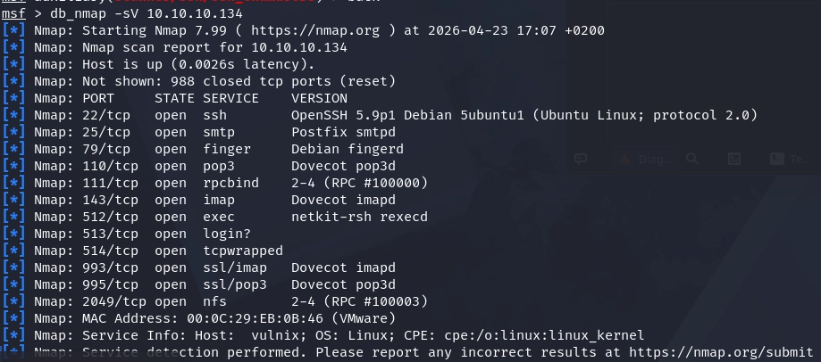
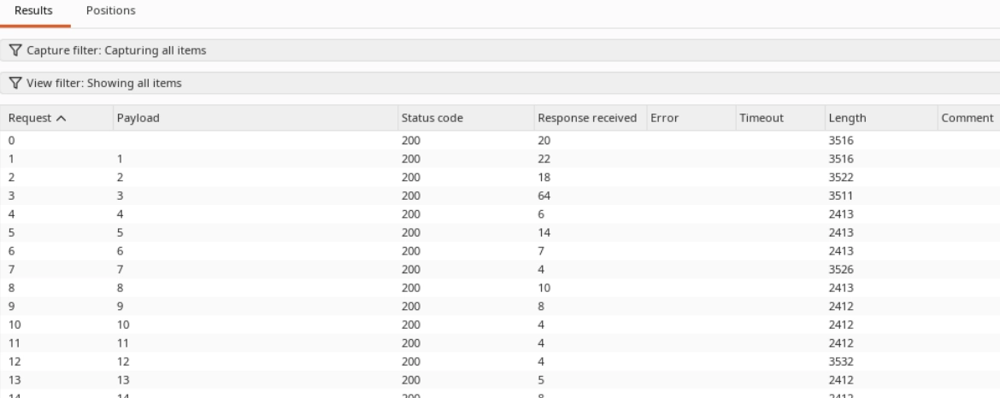
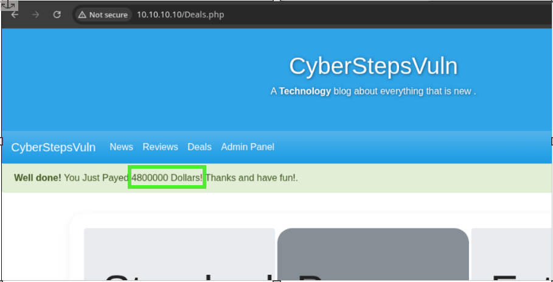
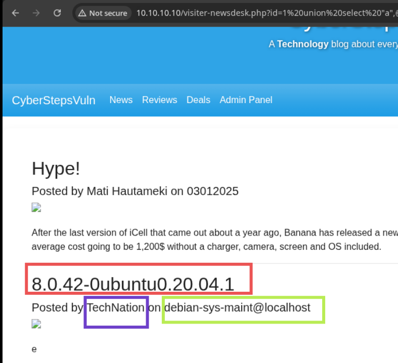
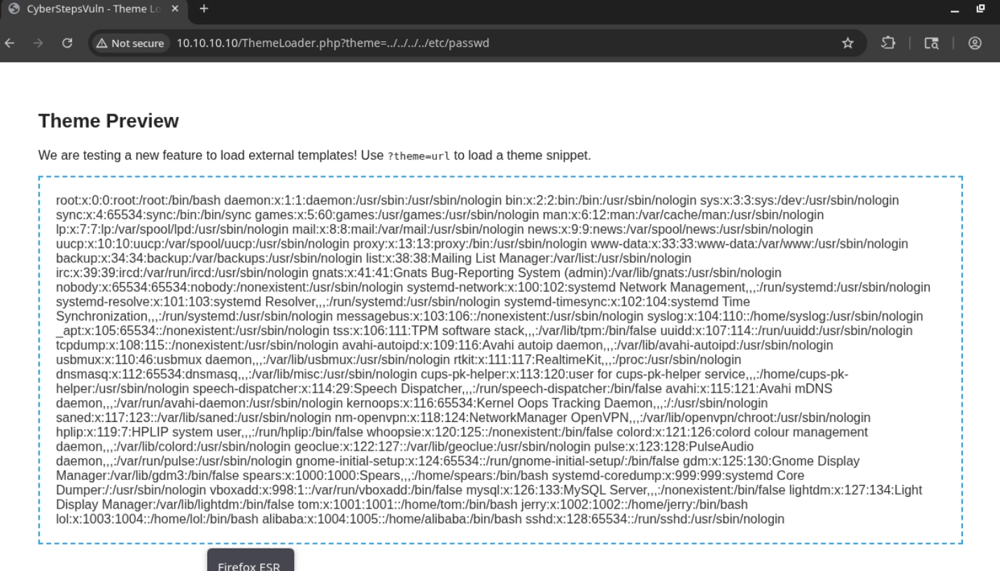
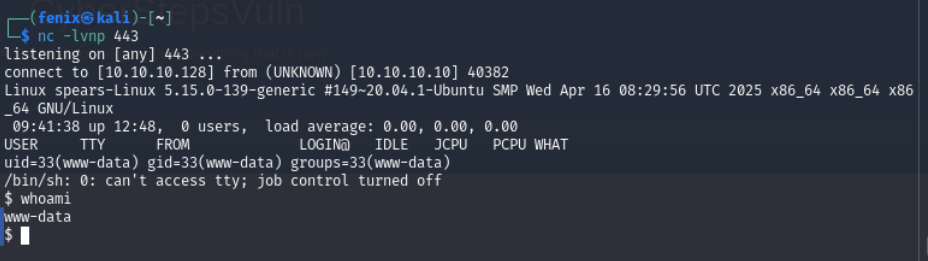
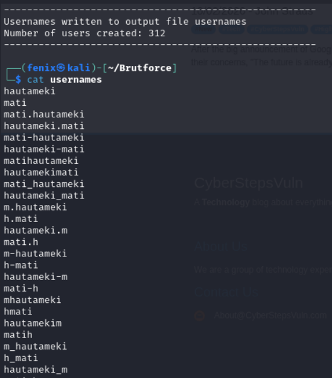

# 🌐 PWNEDsteps — Web Application Penetration Test


> ⚠️ **Disclaimer:** This penetration test was performed in a controlled CyberSteps training lab environment against an intentionally vulnerable web application. All IPs shown are private lab addresses.

## 📋 Executive Summary

Comprehensive penetration test of the **CyberStepsVuln** web application (custom app + WordPress blog). The assessment demonstrated a complete attack chain from information disclosure → credential theft → remote code execution, exposing **critical** security misconfigurations.

**Engagement Type:** Black-box web pentest · **Methodology:** OWASP WSTG · **Date:** April 2026

### The Attack Chain

Recon (Gobuster/Wappalyzer/WPScan) → Info Disclosure → Weak Auth → SQL Injection → User Enumeration → LFI (ThemeLoader) → DB Credentials → File Upload Bypass → RCE → Full System Compromise

## 🎯 Key Findings

| ID | Vulnerability | Severity | CVSS (Est.) | Business Impact |
|----|---------------|----------|-------------|-----------------|
| F-07 | Remote Code Execution (File Upload + LFI) | 🔴 Critical | 9.8 | Complete server compromise |
| F-04 | SQL Injection (News Desk Module) | 🟠 High | 8.6 | Database theft, admin account access |
| F-06 | WordPress Plugin Vulnerabilities | 🟠 High | 8.1 | Admin panel takeover, data exfiltration |
| F-05 | Local File Inclusion (ThemeLoader) | 🟠 High | 7.5 | System config exposure, DB creds |
| F-02 | Weak Authentication & Brute Force | 🟡 Medium | 5.3 | Account takeover, privilege escalation |
| F-03 | Parameter Tampering & CSRF | 🟡 Medium | 5.4 | Fraudulent transactions, financial loss |
| F-01 | Information Disclosure | 🟢 Low | 3.1 | Attack surface mapping |

## 🔍 Methodology

1. **Reconnaissance** — Directory enumeration (Gobuster, FFuF), technology fingerprinting (Wappalyzer), WordPress user enumeration (WPScan, wp-json API)
2. **Vulnerability Analysis** — Manual testing for injection flaws, access control bypass, logical weaknesses
3. **Exploitation** — SQL injection payloads, cookie manipulation, file upload bypass, path traversal
4. **Post-Exploitation** — Privilege escalation, data exfiltration, reverse shell establishment

## 🗡️ Exploitation Details

### 1. Information Disclosure — The Roadmap to Compromise

Directory enumeration revealed sensitive files that became footholds:

- `/robots.txt` → password generator database exposed
- `/decoda9013smith21985.txt` → credentials found
- `/Classifiedadmin` / `/topsecret.html` → classified documents discovered
- Source code comments → version numbers, developer hints (Bootstrap darkmode password field bug)

<p align="center"></p>

**Key insight:** Version exposure in meta tags and error messages gives attackers a roadmap for known exploits.

### 2. Weak Authentication — Cookie Manipulation & Brute Force

**Customer Dashboard — IDOR / Privilege Escalation:**

Session cookie contained unsanitized user ID. Decoded and manipulated via Burp Suite "Sniper" attack to escalate from guest → admin:

```python
# Original cookie: id=guest
# Manipulated: id=admin
# Hash regenerated, session hijacked
```

<p align="center"\>\</p>

**Employee Handbook — Credential Stuffing:**

- Extracted 12 employee email addresses from `/EmployeeHandbook.php` response

- Generated username wordlist from author names using `cupp`

- Fuzzed login endpoint with `ffuf` matching usernames against password lists

```bash
ffuf -u "10.10.10.10/EmployeeHandbook.php?email=USERFUZZ&password=PASSFUZZ" \\ -w usernames=USERFUZZ -w cyberpasswords:PASSFUZZ
```

**WordPress Login — Custom Wordlist Brute Force:**

Enumerated user `mkowalski` via wp-json, gathered personal data from blog profile, generated targeted wordlist, cracked password `marek1503`:

```bash
wpscan --url 10.10.10.10/blog -U mkowalski -P marek.txt
```

### 3. Parameter Tampering & CSRF

**Location:** `/Deals.php` purchase functionality

**Proof of Concept:** Host [`deal4.html`](./scripts/deal4.html) locally and visit while logged into the target application. The auto-submit form changes the price parameter from `$100` to `$4,800,000`.

**Demonstration:**
```bash
# Start local web server
python3 -m http.server 8080

# Visit from victim browser
# http://10.10.10.128:8080/deal4.html
```
The transaction processes under the victim's authenticated session, demonstrating missing CSRF protection and lack of server-side price validation.

<p align="center"></p>

### 4. SQL Injection — Database Extraction

**Location:** `/visiter-newsdesk.php?id=`

Boolean-based blind injection confirmed (`id=1 or 1=1` returns all articles, `id=1 or 1=0` returns none). Union-based extraction revealed full user table:

```sql
-- Column count determined
ORDER BY 6

-- Extract schema
UNION SELECT 1,schema\_name,3,4,5,6 FROM information\_schema.schemata

-- Extract user credentials 
UNION SELECT 1,Email,3,Password,Admin,6 FROM Users
```

<p align="center"\>\</p>

**Result:** All 12 employee accounts extracted including admin credentials (`eliasv@cyberstepsvuln.com`).

### 5. Local File Inclusion — ThemeLoader Exploit

**Location:** `/ThemeLoader.php?theme=` parameter

**Path traversal allowed reading arbitrary system files:**

```
?theme=../../../../../../etc/passwd 
?theme=php://filter/read=convert.base64-encode/resource=/var/www/html/blog/wp-config.php
```
Decoded `wp-config.php` revealed database credentials, enabling further exploitation.

<p align="center"\>\</p>

### 6. Remote Code Execution — The Final Chain

**Attack Vector: File upload bypass + Admin panel LFI**

1. **Created `monkey.php` reverse shell, renamed to `monkey.txt` (client-side extension check only)**

2. **Intercepted upload request in Burp Suite, changed extension to `.php` server-side**

3. **Located uploaded file via path enumeration**

4. **Triggered execution via admin panel file viewer using path traversal:**

`&module=upload&loadfile=../../../../../../var/www/html/\[hash\]/monkey.txt`

<p align="center"\>\</p>

**Result:** Reverse shell established, full server access achieved. Post-exploitation revealed MySQL credentials in `~alibaba/.profile`.

## 🛠️ Remediation Roadmap

### Immediate Priorities

| **Priority** | **Action** | **Effort** |
| :-: | :-: | :-: |
| 🔴 1 | Patch file upload validation (server-side whitelist) | Low |
| 🔴 2 | Implement prepared statements for all SQL queries | Medium |
| 🟠 3 | Fix LFI by whitelisting theme names (reject paths) | Low |
| 🟠 4 | Enforce MFA and account lockout policies | Medium |
| 🟡 5 | Update WordPress core, plugins, themes | Low |
| 🟡 6 | Disable directory listing, remove version exposure | Low |
| 🟡 7 | Implement CSRF tokens on all state-changing forms | Medium |

### Specific Fixes


- **SQL Injection fix → Prepared statements**

- **File upload fix → Whitelist + server validation**

- **LFI fix → Reject path traversal characters**


## ✅ Verification Criteria

Post-remediation checks to confirm fixes:

- File uploads rejected if not in whitelist

- SQL injection payloads return 500 errors (queries sanitized)

- `../` in LFI parameters blocked

- WordPress updated, unused plugins removed

- Directory listing disabled (`Options -Indexes`)

- MFA enforced on all admin/logins

- Session cookies signed with short expiry

## 💡 Lessons Learned

> ***The weakest link wins. This assessment proved that a chain of "medium" and "low" severity issues can cascade into full compromise. Information disclosure gave us the usernames. Weak authentication let us brute-force. SQLi gave us the database. LFI gave us config files. The file upload bypass + admin LFI combo delivered RCE. Each piece alone was annoying; together they were catastrophic.***

**Security is a chain, not a fortress. Patch the holes in the chain before building stronger walls.**

## 🧰 Toolset

**`Burp Suite` · `WPScan` · `Gobuster` · `FFuF` · `Hydra` · `Netcat` · `Python` · `Bash`**

### 🔧 Custom Tools

#### Username Generator (`UsernameGenerator.py`)

Generates 52 username variations per employee from leaked name lists (common in information disclosure phases).

**Usage:**
```bash
python3 username_generator.py [input_file] [output_file]
python3 username_generator.py employees.txt usernames.txt
```
Input format: One name pair per line, In this case it will be used only for the name's author found:

```
Mati Hautameki
```

Output: 

<p align="center"\>\</p>

Context: Used in PWNEDsteps lab to generate targeted wordlists for /EmployeeHandbook.php brute-force attacks via ffuf.


---

## File Permissions & Commit

```bash
# Make executable (optional but professional)
chmod +x username_generator.py

# Commit message
git add scripts/UsernameGenerator.py
git commit -m "Add UsernameGenerator.py: corporate pattern generator for credential stuffing PoCs

- Generates 52 username variations (lowercase + uppercase) per name pair
- Includes input/output validation and error handling
- Documented for ethical use in authorized pen-test engagements only"
```

## 📈 Business Impact

If exploited by a malicious actor in production:

- **Complete server takeover** — attacker controls all data and systems

- **Customer data breach** — credentials, emails, personal information exposed

- **Financial fraud** — parameter tampering enables unauthorized transactions

- **Reputation damage** — defacement and data leakage erode trust

- **Lateral movement** — compromised server used as pivot point for internal network attacks

## 📚 References

- [**OWASP Web Security Testing Guide**](https://owasp.org/www-project-web-security-testing-guide/)

- [**PortSwigger SQLi Cheat Sheet**](https://portswigger.net/web-security/sql-injection)

- [**Pentestmonkey SQL Injection**](http://pentestmonkey.net/category/injection/sql-injection)

- [**CVE Database**](https://nvd.nist.gov/)


**Blue teamer practice: break it, understand it, then fix it better than it was.**

